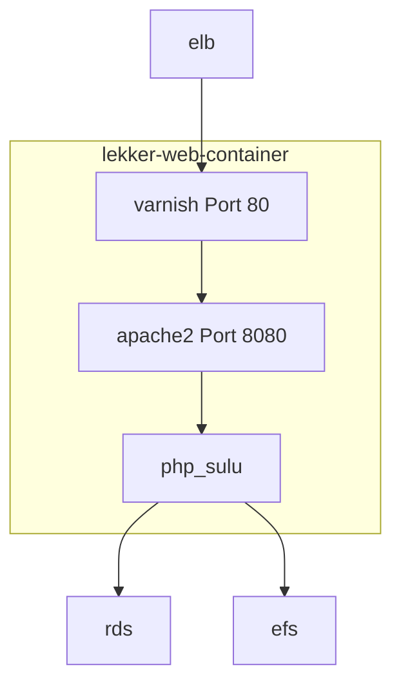

# Data Structure

In this page I try to explain the principles of the datastructure which is created in `redis` by `go-redis`.

## Strings

Strings can be easily stored and read with `SET` and `GET`.

    >> r.set('string', 'hello_github')

    ans =

    OK
    ...
    127.0.0.1:6379> get string
    "hello_github"
    
    >> r.set('string', 'hello github');
    >> r.get('string');
    
    hello github

## Arrays

When you're using `array2redis`, two lists using `RPUSH` will be created.  

The first list will be `keyname.values`.  
The values are stored _(like in the nature of GNU Octave and Matlab)_ in one column. It's simple [Column Major Order](https://en.wikipedia.org/wiki/Row-major_order). 

The second list is `keyname.dimension`.  
This is where the information of `size(array)` is stored. _(column major order too)_.

At least, `keyname` is the group of `keyname.values` and `keyname.dimension` using `SADD`.

You can save any numerical array (size and number of dimensions doesn't matter). The only limitting factor might be your bandwidth to redis and the max memory size of your redis instance.  

With `redis2array` you can read back the array to Matlab/Octave.

When you've just need a range of your array, you can simply use `range2array`. But take care, it only support 2D and 3D arrays!

